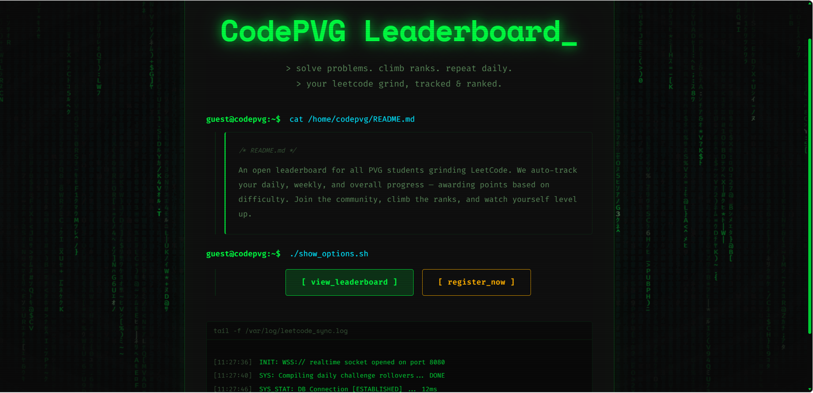
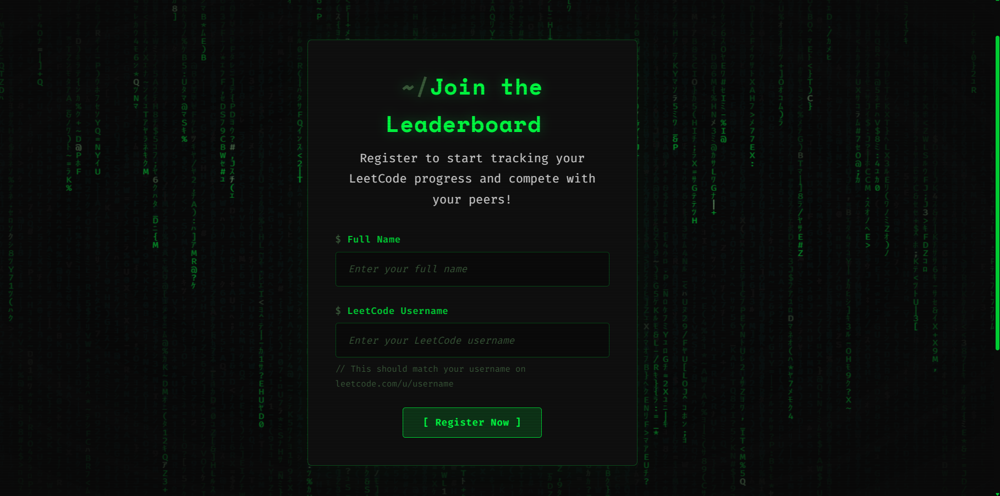
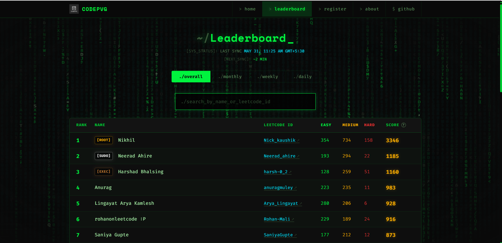

# CodePVG LeetCode Ranking

A web-based platform developed by [CodePVG](https://www.linkedin.com/company/codepvg/) to track and rank students of [PVG COET](https://www.pvgcoet.ac.in/) based on their LeetCode performance

It allows users to register with their LeetCode username and automatically fetches their problem-solving statistics to display on a leaderboard.

---

## Purpose

The goal of this project is to:

- Encourage consistent problem-solving among students
- Create a competitive yet motivating environment
- Provide visibility into individual coding progress

---


## Screenshots
A quick preview of the platform UI. The appearance may evolve as the project develops.
### Home Page



### Registration Page




### Leaderboard




## Related Repositories

- [leetcode-ranking-data](https://github.com/codepvg/leetcode-ranking-data) – The database repository where raw JSON data and historical stats are stored
- [leetcode-api](https://github.com/codepvg/leetcode-api) – API used to fetch user data from LeetCode
- [lc-backend](https://github.com/codepvg/lc-backend) – Backend service for storing and managing leaderboard data
- [frontend-uptime-monitor](https://github.com/codepvg/frontend-uptime-monitor) – Pinger service to monitor frontend server uptime
- [backend-uptime-monitor](https://github.com/codepvg/backend-uptime-monitor) – Pinger service to monitor backend server uptime

---

## Project Structure

```
leetcode-ranking/
│── frontend/        # UI (HTML, CSS, JS) - Fetches data from leetcode-ranking-data
│── scripts/         # Automation scripts (sync-leaderboard.js)
│── server.js        # Express server
│── package.json
```

> [!NOTE]
> All leaderboard data is now decoupled and stored in the [leetcode-ranking-data](https://github.com/codepvg/leetcode-ranking-data) repository to prevent commit history bloat in this repo.

---

## How to Run Locally

### 1. Fork and clone the repository

First, fork the repository to your GitHub account. Then clone it locally:

```bash
git clone https://github.com/YOUR-USERNAME/leetcode-ranking.git
cd leetcode-ranking
```

### 2. Install dependencies

`npm install`

### 3. Run the project

`npm run dev`
or
`node start`

## Usage

1. Open the registration page
2. Enter your name and LeetCode username
3. Submit the form
4. View your ranking on the leaderboard after the next sync

---

## Contributing

Contributions are welcome.

- Fork the repository
- Create a new branch
- Make your changes
- Submit a Pull Request
